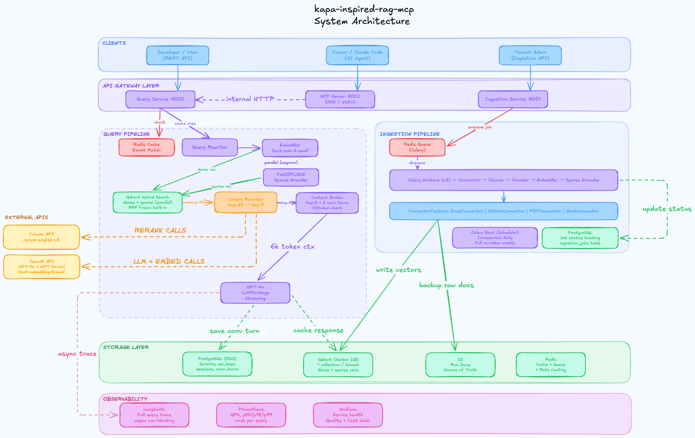

<div align="center">


### Md Ayan Arshad &nbsp;·&nbsp; Data Scientist &nbsp;·&nbsp; IIT Madras

[](https://linkedin.com/in/md-ayan-arshad-740288248/)
[](https://ayanarshad02.github.io)
[](https://dev.to/ayanarshad02)
[](https://www.youtube.com/@MLwithAyanIITM)
[](mailto:ayanarshad2002@gmail.com)

</div>

---

## About

I'm a Data Scientist at **Softeon**, working on production multi-tenant RAG and conversational AI for enterprise supply chain software — while finishing my BS at IIT Madras. My focus is on the engineering side: making GenAI reliable, observable, and cost-predictable in systems real users depend on.

Before Softeon, I shipped a GPT-powered LinkedIn outreach system at Second Brain Labs and taught Python and ML to 100+ students at Antern. Building things and explaining them clearly have both been part of the work from the start.

---

## Currently

```text
Role     →  Data Scientist · Softeon, Chennai (Full-time)
College  →  IIT Madras · BS Data Science · Expected Nov–Dec 2026
Focus    →  Production RAG · Agentic AI · GenAI System Design
Open to  →  Remote GenAI/ML roles · US/EU timezones
```

---

## Highlights

- **Converted internship → full-time** at Softeon while still in college; end-to-end ownership of production multi-tenant RAG pipelines serving real enterprise customers
- Built a kapa.ai-inspired **multi-tenant RAG platform** from scratch - 10 Docker containers, hybrid search, MCP server, Prometheus/Grafana observability
- Cross-encoder reranking improved **Context Precision by +0.15** (measured with RAGAS); grounding validation runs as a blocking step
- RAGAS eval tied to CI/CD with **auto-rollback on quality drop**; golden query set per tenant, nightly + per-ingestion runs
- IIT Madras Topper Badges in Python, Bash, ML (Rank 106 / 1700+, Score 93/100)
- Mentored **100+ students** in Python & ML · Launched two free cohort-based courses (PY001 & PY002)

---

## Featured Projects

### 🔹 [kapa-inspired RAG MCP System](https://github.com/AyanArshad02/kapa-inspired-rag-mcp)

**The problem:** Developer-tool companies use products like [kapa.ai](https://kapa.ai) to power AI assistants over their docs, GitHub repos, and PDFs. I wanted to understand what it actually takes to build something like this with real multi-tenancy and observability, so I built it.

**What I shipped:** A production-grade, multi-tenant RAG platform across 10 Docker containers, with an MCP server that exposes the full pipeline as a native tool for Claude Desktop.

| Layer                    | What it does                                                                                                                          |
| ------------------------ | ------------------------------------------------------------------------------------------------------------------------------------- |
| **Ingestion**      | Docs (BeautifulSoup + HeadingAwareChunker), GitHub repos (AST-based code chunker), PDFs (pymupdf4llm) → Celery async workers         |
| **Query pipeline** | SHA-256 cache → hybrid search (RRF fusion of dense + sparse) → Cohere reranker (top-20 → top-5) → GPT-4o-mini via SSE stream      |
| **Multi-tenancy**  | Separate Qdrant collection per tenant · Redis cache keyed by `sha256(tenant_id + query)` · API keys stored as SHA-256 hash only   |
| **Freshness**      | HMAC-verified GitHub webhooks (~10s incremental vs ~8min full re-index) · 6h Celery Beat polling · atomic S3 + DB cleanup on delete |
| **MCP Server**     | `search_knowledge_base` (full pipeline) + `fetch_and_query_online_docs` (ephemeral, zero Qdrant writes) — stdio + SSE transport  |
| **Observability**  | Prometheus + Grafana · LangSmith traces · RAGAS eval (faithfulness + context precision per source type)                             |

**Architecture:**



**Key decisions and why:**

- **RRF over weighted sum** — rank-based fusion avoids calibrating incomparable dense/sparse score scales
- **Per-tenant Qdrant collections over shared + filter** — hard isolation, zero query overhead, independent scaling
- **`acks_late=True` on Celery tasks** — task stays on queue until ACK; no silent data loss if a worker crashes mid-job

**What I'd do differently:** Proper React frontend instead of Streamlit, and per-tenant cost dashboards built in from day one.

`FastAPI` `Qdrant` `Redis` `PostgreSQL` `Celery` `OpenAI` `Cohere` `FastMCP` `Docker` `RAGAS` `Streamlit`

---

### 🔹 Production Multi-Tenant RAG · Softeon *(proprietary)*

Enterprise RAG powering conversational AI for supply chain software, used by real customers.

- Pinecone namespace isolation per tenant — no shared collection, no filter overhead, independent scaling per client
- Cross-encoder reranking (top-10 → top-3); inline grounding validation as a **blocking** step before any response is returned
- RAGAS eval on nightly + per-ingestion runs; golden query set tied to CI/CD with auto-rollback on quality drop
- Circuit breakers + fallback LLM routing; context drift and embedding distribution shift detection
- Stack: OpenAI · Anthropic Claude · AWS Bedrock · FastAPI · AWS (EC2, Lambda, DynamoDB, SQS, Cognito, ECR, CloudWatch)

---

### 🔹 LinkedIn Outreach Chatbot · Second Brain Labs *(proprietary)*

GPT-powered outreach system integrated with the LinkedIn API. Handled live campaign traffic across multiple client accounts — automated lead qualification and multi-turn conversation flows.

`GPT-4` `LinkedIn API` `Python`

---

<details>
<summary>Older Projects</summary>

### 🔹 [MLOps Vehicle Insurance Predictor](https://github.com/AyanArshad02/MLOps-Vehicle-Insurance-Predictor)

End-to-end MLOps pipeline: data ingestion → training → deployment on AWS EC2.

`MongoDB` `Docker` `FastAPI` `AWS EC2` `CI/CD`

---

### 🔹 [MLOps Credit Card Fraud Detection](https://github.com/AyanArshad02/Credit-Fraud-Detection)

Real-time fraud detection pipeline with full MLOps instrumentation and alerting.

`AWS` `Kubernetes` `Prometheus` `Grafana` `DVC` `MLflow` `Dagshub`

---

### 🔹 [Email Marketing Campaign Optimization](https://github.com/AyanArshad02/email-marketing-campaign-optimization-using-ML)

ML-driven campaign optimization with an A/B testing framework for maximizing click-through rates.

</details>

---

## Tech Stack

**GenAI / RAG**


**Vector Databases & Storage**


**Cloud & Infrastructure**


**Languages & ML**


---

## Journey

Joined IIT Madras in 2022 with one goal: get hired in industry before graduating, without relying on campus placements. Spent the first six months stuck in a Python tutorial loop — kept re-learning the basics without shipping anything. Breaking out of that by doing real projects changed the trajectory.

First internship was at Second Brain Labs in Sep 2024, shipping a production chatbot. Took on ML teaching at Antern at the same time. Joined Softeon as a data science intern in May 2025, converted to full-time by August — while still two years from graduation.

---

## Content & Community

I write about what I've actually shipped — production RAG failures, multi-tenancy trade-offs, GenAI system design — on LinkedIn and Medium.

- ✍️ [LinkedIn](https://linkedin.com/in/md-ayan-arshad-740288248/) — RAG failures, eval pipelines, AI NFRs, career lessons
- 📝 [Dev.to](https://dev.to/ayanarshad02) — technical deep-dives
- 🎥 [YouTube](https://www.youtube.com/@MLwithAyanIITM) — ML content
- 👨‍🏫 Mentored 100+ students · PY001 & PY002 free cohort-based Python courses

---

## GitHub Stats

<div align="center">


 


<br/>


</div>

---

<div align="center">

**Open to remote GenAI/ML engineering roles (US/EU timezones).**
If you're building production AI systems or just want to talk shop about RAG/agents, feel free to reach out.

[](https://linkedin.com/in/md-ayan-arshad-740288248/)
[](https://ayanarshad02.github.io)
[](https://dev.to/ayanarshad02)
[](https://www.youtube.com/@MLwithAyanIITM)
[](mailto:ayanarshad2002@gmail.com)

</div>
